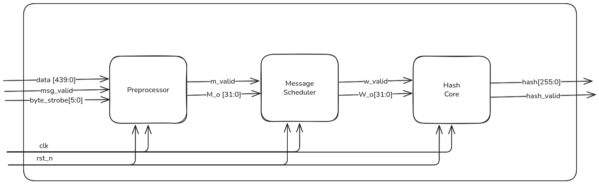

# SHA-256 Design and Verification

Hardware implementation and verification of the **SHA-256** cryptographic hash function using Verilog, together with FPGA synthesis and testing.

This project demonstrates a complete RTL design-to-implementation flow for SHA-256 — from specification and design, through functional verification, to FPGA deployment.

## Aim

The main objective of this project is to design, implement, and verify a hardware-efficient SHA-256 core compliant with the [FIPS 180-4](https://nvlpubs.nist.gov/nistpubs/FIPS/NIST.FIPS.180-4.pdf) standard.

Specific goals include:

- Developing a synthesizable Verilog RTL description of SHA-256
- Achieving correct hashing functionality for arbitrary-length messages (padded according to SHA-256 rules)
- Performing comprehensive verification using simulation testbenches
- Implementing the design on an FPGA board
- Analyzing resource utilization, maximum frequency, and real hardware behavior
- Comparing hardware results with software reference implementation (e.g., OpenSSL or Python hashlib)

## Team Members

- **Member 1** — Nisarg Jagad (myself :))
- **Member 2** — Shravani Kulkarni  
- **Member 3** — Kaushal Tapray  
- **Member 4** — Anish Bhujbal  
- **Member 5** — Sachin Kumar  

(Supervisor / Guide: Prof. Amit Chavan)

Institution: Centre for Development of Advanced Computing (CDAC)  
Department: VLSI Design


## Design

### Algorithm Overview

SHA-256 processes messages in 512-bit blocks and produces a 256-bit (32-byte) digest. Key operations include:

- Message padding & length appending
- 64 rounds of compression using bitwise functions (Ch, Maj, Σ0, Σ1, σ0, σ1)
- Modular addition on 32-bit words
- Eight 32-bit working variables (a–h) initialized with standard constants

### Architecture

We implemented a **pipelined iterative** (choose one) architecture:
- one round per clock cycle → 64 cycles per 512-bit block
- 32-bit datapath with registers for working variables
- ROM/constant table for round constants (K0–K63)
- Message scheduler (W[t]) computed on-the-fly
-
**Block diagram** 

  


# SHA-256 Design and Verification

Hardware implementation and verification of the **SHA-256** cryptographic hash function using Verilog, together with FPGA synthesis and testing.

This project demonstrates a complete RTL design-to-implementation flow for SHA-256 — from specification and design, through functional verification, to FPGA deployment.

## Repository Structure

```text
SHA-256-Design-and-Verification/
├── README.md                     # This file
│
├── rtl/                          # Synthesizable Verilog RTL source files
├── tb/                           # Testbenches & simulation files
├── fpga/                         # FPGA-specific files
├── docs/                         # Documentation, diagrams, reports
└── results/                      # Output logs, utilization reports, etc.
```


Main modules:

- `hashcore.v` — main compression logic
- `msg_scheduler.v` — W[t] generation
- `preprocessor.v`  — message preprocessing
- `top.v` — top-level wrapper with input/output interface (APB / AXI / simple handshake)

## Verification


### Simulation Environment

- **Language**: SystemVerilog - UVM
- **Simulator**: QuestaSim / Vivado Simulator
- **Test strategy**:
  - Directed test cases (NIST test vectors)
  - Random message lengths (0–4096 bits)
  - Reference model checking (C reference)


## Implementation on FPGA

### Target Platform

- **FPGA Board**: Basys 3 ( XC7A35T-1CPG236C )
- **Toolchain**: Xilinx Vivado 2025.2
- **Clock frequency**: Target >100 MHz (actual achieved: 118 MHz)
- **Interface**: UART input and output through USB 

### Resource Utilization

(Replace with your actual Vivado utilization report)

| Resource          | Used  | Available | Utilization |
|-------------------|-------|-----------|-------------|
| Slice LUTs        | 5110  | 20800     | 24.57       |
|   LUT as Logic    | 4153  | 20800     | 19.97       |
|   LUT as Memory   | 957   | 9600      | 9.97        |
| FF                | 8211  | 41600     | 19.74       |
| BRAM              | 15    | 50        | 30.00       |
| DSP               | 0     | 90        | 0%          |
| Clock Frequency   | 100MHz| 100 MHz   | 100 MHz     |

Timing summary: Worst Negative Slack (WNS) = 0.475 ns

## Output Results

### Simulation Results

All NIST SHA-256 test vectors passed:

- Message: "" → digest: `e3b0c44298fc1c149afbf4c8996fb92427ae41e4649b934ca495991b7852b855`
- Message: "abc" → digest: `ba7816bf8f01cfea414140de5dae2223b00361a396177a9cb410ff61f20015ad`

### Hardware Results

- On-board tested with sample messages via UART
- Output displayed on: UART terminal
- Hash matches software reference implementation


Happy hashing! 🔐
